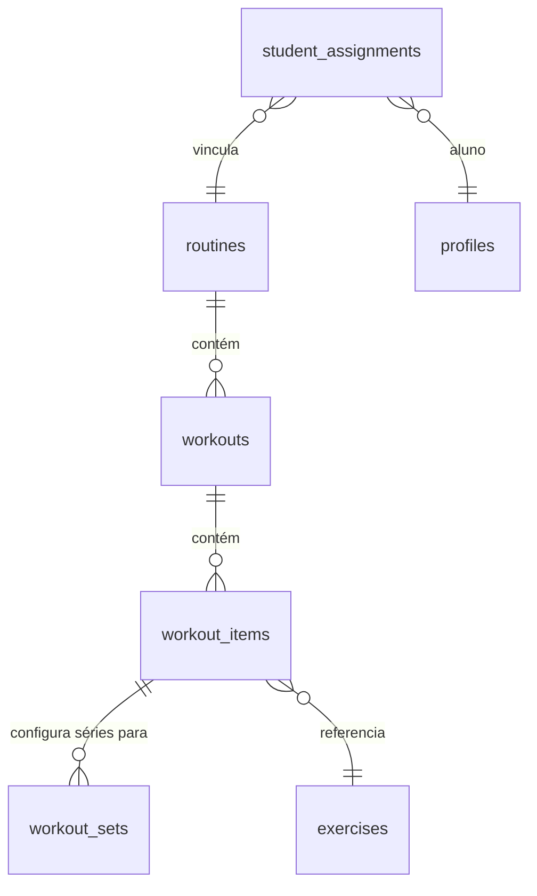
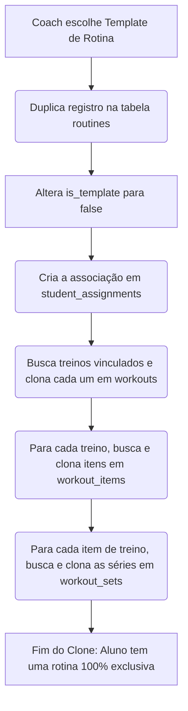

# Guia de Modelagem e Fluxo de Banco de Dados: Rotinas e Treinos

Este documento serve como referência de arquitetura para a criação de um sistema de biblioteca de rotinas de treino, treinos dentro da rotina, exercícios e prescrição individualizada de séries (série por série) para atletas/alunos.

---

### ⚠️ AVISO PARA IMPLEMENTAÇÃO EM OUTROS PROJETOS
> **Importante:** A modelagem apresentada a seguir utiliza os nomes de tabelas e colunas do projeto original. Se você estiver usando este guia para construir ou migrar para outro banco de dados, **você deve adaptar** os nomes das colunas, tabelas, tipos de dados e chaves estrangeiras para corresponder ao seu próprio banco de dados.

---

## 1. Modelagem do Banco de Dados (Schema Relacional)

A arquitetura utiliza 5 tabelas principais que organizam os treinos de forma hierárquica, do nível macro (Rotina) ao micro (Séries específicas de cada exercício).

### A. Tabela de Rotinas (`routines`)
Representa o planejamento de treino de longo prazo (ex: *"Hipertrofia ABC - 8 Semanas"*).
*   `id` (`UUID`): Chave primária.
*   `coach_id` (`UUID`): Chave estrangeira referenciando o treinador criador.
*   `name` (`TEXT`): Nome da rotina de treinos.
*   `description` (`TEXT`, opcional): Detalhes da rotina.
*   `duration_weeks` (`INTEGER`): Quantidade de semanas sugeridas para execução.
*   `is_template` (`BOOLEAN`): **Chave do fluxo.** Se for `true`, esta rotina é mantida como um template geral reutilizável pelo coach. Se for `false`, é uma rotina copiada e vinculada exclusivamente a um aluno específico.

### B. Tabela de Treinos (`workouts`)
Os blocos de treino diários associados à rotina (ex: *"Treino A: Peito e Tríceps"*, *"Treino B: Pernas"*).
*   `id` (`UUID`): Chave primária.
*   `routine_id` (`UUID`): Chave estrangeira que referencia `routines.id` (Deletada em cascata caso a rotina seja excluída).
*   `name` (`TEXT`): Nome do treino (ex: *"Treino A"*).
*   `day_number` (`INTEGER`, opcional): Identificador numérico do dia da semana ou sequência.
*   `order_index` (`INTEGER`): Controla a ordenação visual sequencial dos treinos no painel.

### C. Tabela de Itens de Treino (`workout_items`)
Tabela intermediária N:N ligando exercícios a treinos específicos.
*   `id` (`UUID`): Chave primária.
*   `workout_id` (`UUID`): Chave estrangeira que referencia `workouts.id`.
*   `exercise_id` (`UUID`): Chave estrangeira que referencia a tabela global de exercícios (`exercises.id`).
*   `order_index` (`INTEGER`): Ordem de execução do exercício dentro daquele treino específico.
*   `coach_notes` (`TEXT`, opcional): Observações particulares deixadas pelo treinador para o aluno sobre a execução do exercício (ex: *"Fazer amplitude máxima"*).

### D. Tabela de Séries Prescritas (`workout_sets`)
Onde fica a configuração detalhada de metas de cada série (**série por série**).
*   `id` (`UUID`): Chave primária.
*   `workout_item_id` (`UUID`): Chave estrangeira que referencia `workout_items.id`.
*   `set_order` (`INTEGER`): Índice da série (1ª série, 2ª série, etc.).
*   `type` (`ENUM`): Classificação da série para planejamento metabólico (`warmup` [aquecimento], `working` [série de trabalho], `failure` [até a falha], `drop` [dropset], `preparation` [série preparatória]).
*   `rest_seconds` (`INTEGER`): Tempo sugerido de descanso em segundos após finalizar a série.

#### Metas de Exercício Dinâmicas (Por Tipo de Exercício):
Para dar suporte aos tipos de exercícios cadastrados (musculação convencional, tempos isométricos, e aeróbicos/HIIT):
*   **Musculação Tradicional:**
    *   `reps_target` (`TEXT`, opcional): Faixa de repetições planejada (ex: `"8-12"` ou `"12"`).
    *   `weight_target` (`NUMERIC`, opcional): Peso/Carga inicial sugerida.
    *   `rpe_target` (`NUMERIC`, opcional): Índice RPE (Percepção de Esforço) sugerido de 1 a 10.
*   **Tempo / Isometria:**
    *   `time_target` (`INTEGER`, opcional): Tempo de execução sugerido em segundos (ex: `60` segundos).
*   **Cardio & Aeróbico:**
    *   `distance_target` (`NUMERIC`, opcional): Distância sugerida em Km.
    *   `speed_target` (`NUMERIC`, opcional): Velocidade média recomendada em km/h.
*   **Cardio HIIT:**
    *   `hiit_work_seconds` (`INTEGER`, opcional): Tempo de alta intensidade em segundos.
    *   `hiit_rest_seconds` (`INTEGER`, opcional): Tempo de descanso ou recuperação ativa em segundos.
    *   `hiit_work_speed` (`NUMERIC`, opcional): Velocidade recomendada durante o esforço rápido.
    *   `hiit_rest_speed` (`NUMERIC`, opcional): Velocidade sugerida durante o descanso ativo.
    *   `hiit_cycles` (`INTEGER`, opcional): Quantidade de ciclos (rounds) de HIIT programados.

---

## 2. Fluxo de Prescrição e Edição Individual por Aluno

Para que as alterações de treino feitas para um aluno não afetem os modelos (templates) padrão que o treinador usa para outros alunos, é executado um fluxo de **Clonagem Profunda (Deep Clone)**:

### Passos do Processo:
1.  **Vínculo com Aluno (`student_assignments`)**:
    Esta tabela mapeia o `student_id` (UUID do perfil do aluno) à `routine_id` (ID da nova rotina clonada), contendo flags como `is_active` (`BOOLEAN`) e datas de início/fim.
2.  **Duplicação em Cascata no Banco**:
    *   Cria-se uma cópia exata do registro em `routines`, alterando `is_template` para `false` e definindo um novo `id`.
    *   Copiam-se todas as linhas em `workouts` vinculadas à rotina antiga, apontando para o ID da nova rotina.
    *   Copiam-se todas as linhas em `workout_items` vinculadas aos treinos duplicados.
    *   Copiam-se todas as linhas em `workout_sets` vinculadas aos itens duplicados.
3.  **Edição Exclusiva**:
    A partir de agora, quando o treinador edita o treino de um aluno nas telas do aplicativo, ele está modificando diretamente os registros específicos dessa cópia (`is_template = false`). O template original permanece intacto na biblioteca do coach.

---

## 3. Logs e Histórico de Execução (O que o Aluno de Fato Executa)

Para registrar a execução real dos treinos sem corromper ou perder o planejamento configurado em `workout_sets`, o banco de dados armazena os dados reais de conclusão em duas tabelas de log separadas:

### A. Tabela de Logs de Treino (`workout_logs`)
Registra a sessão geral de treino realizada pelo aluno.
*   `id` (`UUID`): Chave primária.
*   `student_id` (`UUID`): Identificador do aluno.
*   `workout_id` (`UUID`, opcional): Referência ao treino planejado que originou a sessão.
*   `started_at` (`TIMESTAMPTZ`): Data/Hora de início do treino.
*   `finished_at` (`TIMESTAMPTZ`): Data/Hora de término do treino.
*   `effort_rating` (`INTEGER`): Percepção de esforço sentida no treino completo (de 1 a 10).
*   `feedback_notes` (`TEXT`): Comentários livres do aluno sobre o treino.

### B. Tabela de Logs de Séries Realizadas (`set_logs`)
Registra os valores e métricas reais alcançados em cada série.
*   `id` (`UUID`): Chave primária.
*   `workout_log_id` (`UUID`): Chave estrangeira que referencia `workout_logs.id` (Deletada em cascata).
*   `exercise_id` (`UUID`): Referência ao exercício concluído.
*   `set_type` (`ENUM`): Tipo de série realizada.
*   **Dados Reais de Conclusão:**
    *   `weight_kg` (`NUMERIC`): Carga real utilizada.
    *   `reps_completed` (`INTEGER`): Repetições reais concluídas.
    *   `rpe_actual` (`NUMERIC`): RPE (Percepção de esforço) real sentido na série.
    *   `time_completed` (`INTEGER`): Segundos reais de execução (para isometrias).
    *   `distance_completed` (`NUMERIC`): Distância real percorrida.
    *   `speed_actual` (`NUMERIC`): Velocidade média mantida.
    *   `hiit_cycles_completed` (`INTEGER`): Ciclos de HIIT que o aluno conseguiu concluir.
